# WebShop

## Author

- **Name**: Rifat Bin Monsur
- **Email**: rifat.binmonsur@abo.fi

## Implemented Requirements

This project has all the implementation of mandatory and optional requirements.

### Mandatory Requirements:

- **RQ 1: Project Folder:**
  - Root folder contains `readme.md` listing name, email, implemented requirements, and run instructions.
  - Backend folder contains `requirements.txt`.
  - Frontend folder contains `package.json` and source files.
- **RQ 2: Backend:**
  - Built using Django v5.1.4.
  - Provides an API and serves JSON to the shop page and HTML for the landing page.
  - Uses SQLite as the database.
- **RQ 3: Frontend:**
  - Implemented using React v18.3.1.
- **RQ 4: Automatic Database Population:**
  - A button or link populates the database with 6 users and 30 items, clears the database before repopulation, and updates the landing page with a message.
- **RQ 5: Browse Items:**
  - Any user can view a list of items for sale with details such as title, description, price, and date added.
- **RQ 6: Create Account:**
  - Users can register by providing a username, password, and email.
- **RQ 7: Login:**
  - Registered users can log in with their username and password.
- **RQ 8: Add Item:**
  - Authenticated users can add items to sell by providing a title, description, and price.
- **RQ 9: Add to Cart:**
  - Authenticated users can add items to their cart, excluding their own items.

### Optional Requirements:

- **RQ 10: Search:**  
  Users can search for items by part of the product title. Search function results in an API request.
- **RQ 11: Remove from Cart:**  
  Items can be removed from the cart by the buyer.
- **RQ 12: Pay:**  
  Buyers can view items in the cart and proceed with a payment system that handles price changes or unavailable items.
- **RQ 13: Routing:**  
  Implemented as a Single Page Application (SPA) with routes such as `/`, `/register`, `/login`, `/my-products`, `/cart`, and `/my-orders`.
- **RQ: 14: Edit Account:**  
  Authenticated users can change their password.
- **RQ 15: Display Inventory:**  
  Authenticated users can view their items from the "Inventory" page in the user menu, items are categorised as 'Available' and 'Sold Out'
- **RQ 16: Edit Item:**  
  Sellers can update the price of items that are still available.
- **Non-functional:**  
  The web pages are designed to be user-friendly and visually appealing on desktop screens. UI design is inspired from the Åbo Akademi Webshop.

### Additional Implementations:

- **Product Quantity:**  
  Users can create their own products with multiple quantities, and can order in multiple quantities as long as the product is availalbe in that quantity.
- **Product Edit:**  
  User can edit any information of their own product.
- **Automatic DB population:**  
  One additional button "Populate Database" is added to create one additional user with 2 products of that user without deleting the existing data in database.

---

## How to Run the Project

### Prerequisites

Make sure you have the following installed on your system(these version has been used while local development however older version may work):

- **Python 3.12.8 or later**
- **Node v20.18.0 or later**

### Step-by-Step Instructions

#### 1. Clone the Repository

```bash
git clone https://github.com/AA-IT-WebTechCourse/webshopproject2024-rifatshampod
cd webshopproject2024-rifatshampod
```

#### 2. Set up a Virtual Environment

```bash
python -m venv env
source env/Scripts/activate  # For Windows
# For macOS/Linux:
# source env/bin/activate
```

#### 3. Install Dependencies

```bash
pip install -r requirements.txt
```

#### 4. Apply Migrations

```bash
python manage.py migrate
```

#### 5. Run the Development Backend Server

```bash
python manage.py runserver
```

Or

```bash
 python manage.py runserver 127.0.0.1:8000
```

Or

```bash
 python manage.py runserver 127.0.0.1:8000 --noreload
```

**note**: Make sure that backend server runs 8000 port and port is available locally. Incase the server is run on different port then .env file on frontend directory should be updated accordingly so that frontend can connect proper backend.

#### 6. Run the Development frontend server or locally in production mode

Production Mode (Faster Browsing)

```bash
cd frontend
npm install
# npm run build
# The command should re-generate the build files from your machine
npm run start
```

Dev Mode (Slow Browsing)

```bash
cd frontend
npm install
npm run dev
```

**note:**

- While running the application in development mode, you might need to refresh the browser for the first time to resolve any initial errors.
- This behavior is sporadic and does not occur in production mode.

#### 7. Validate the successful running servers

- Frontend UI: Visit http://localhost:5173/ in your browser to access the webshop.
- Backend Landing Page: Visit http://127.0.0.1:8000/ to confirm the backend is running.

If both backend and frontend server runs properly then start browsing the application. There is optional to populate the database. Make sure to popuate to start the testing.

## Samples of Webshop

Here is a series of images to demonstrate:

#### Testing Landing Page with populate buttons

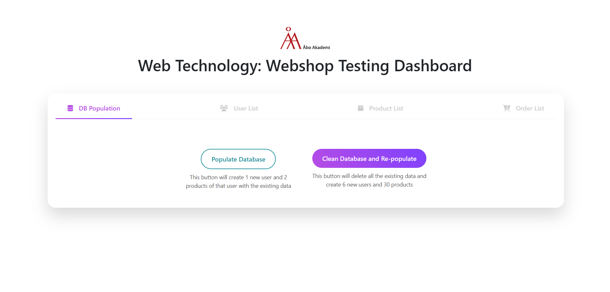

---

#### User list in landing page

## 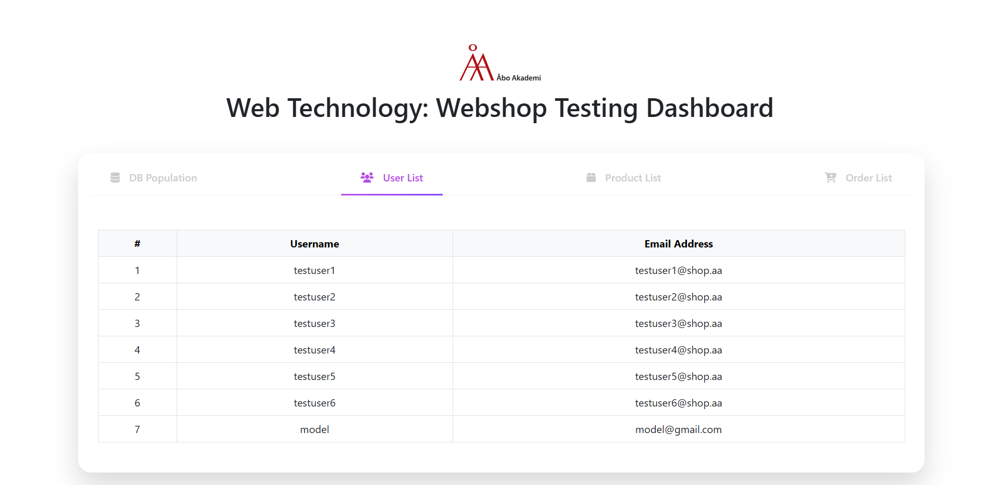

#### Product list in landing page

## 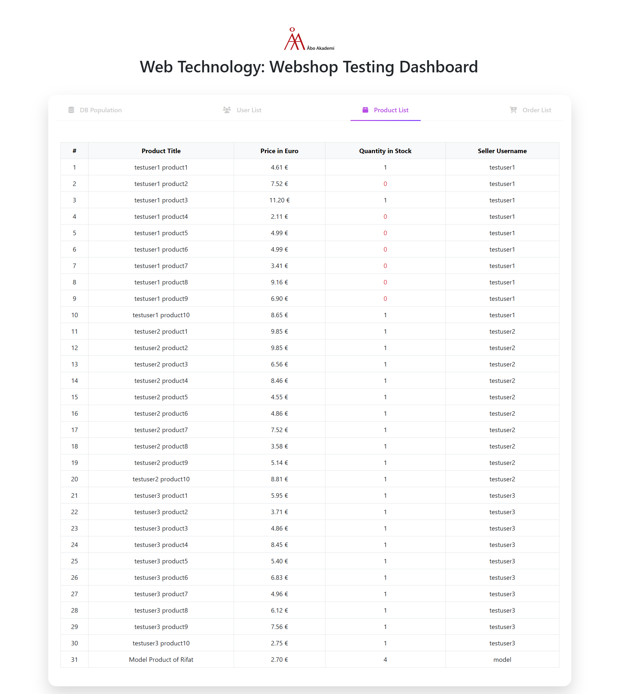

#### Order list in landing page

## 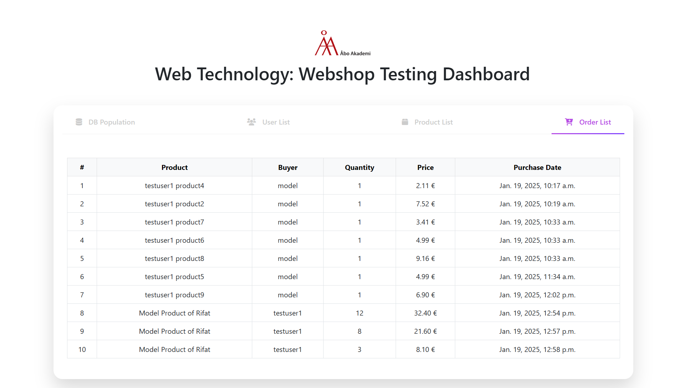

#### Webshop Home page

## 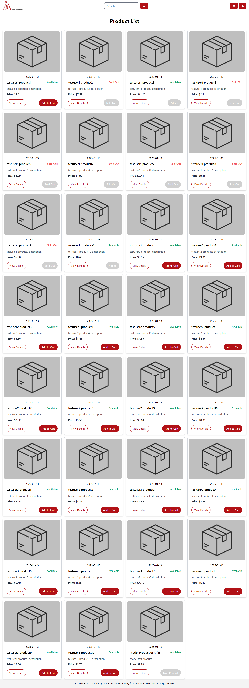

#### Webshop user registration page

## 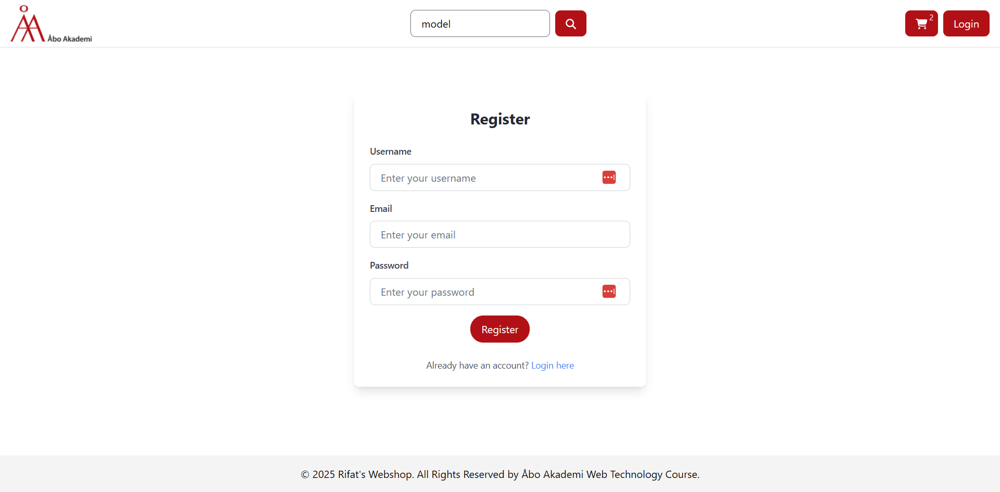

#### Search result page after searching with a part of product title

## 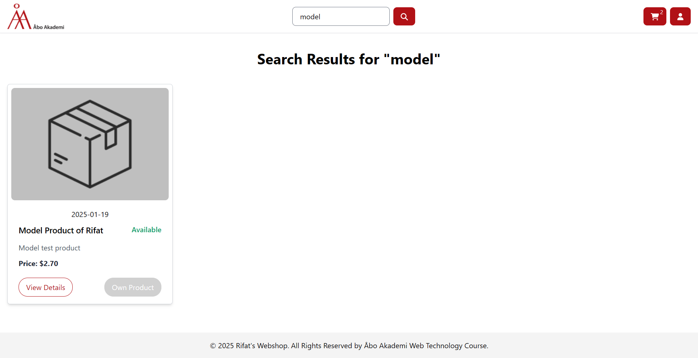

#### Product creation page for authenticated user

## 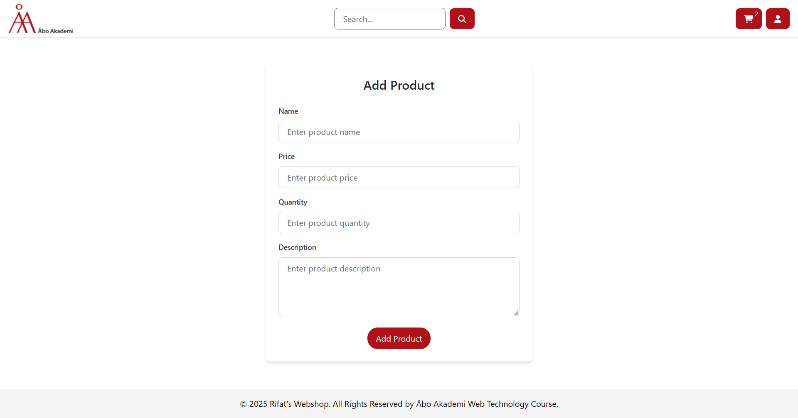

#### Own product list of an authenticated user

## 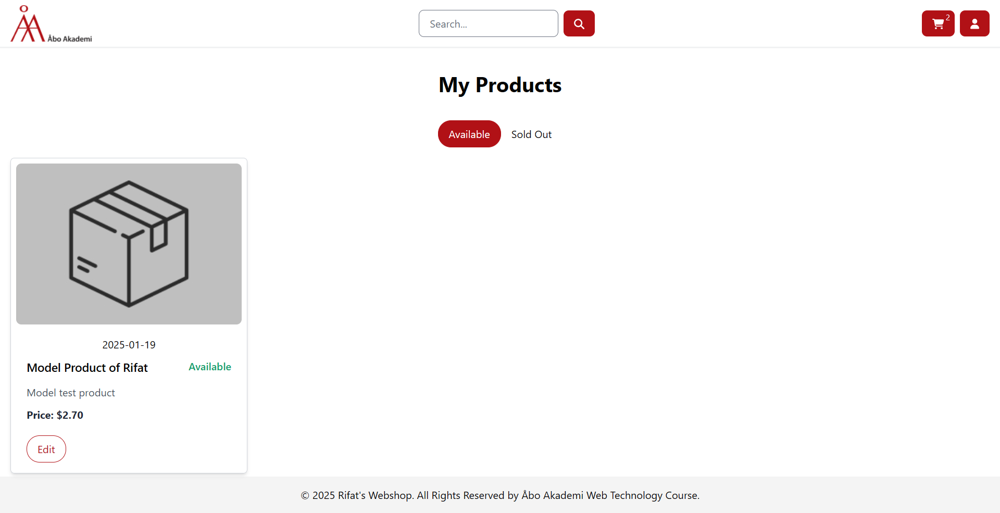

#### User Cart

## 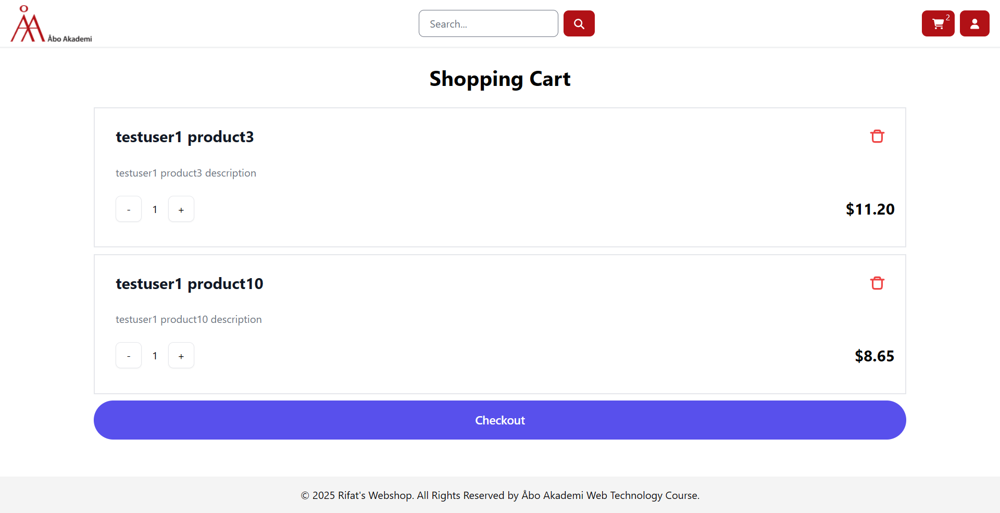

#### Checkout page with price change notification

## 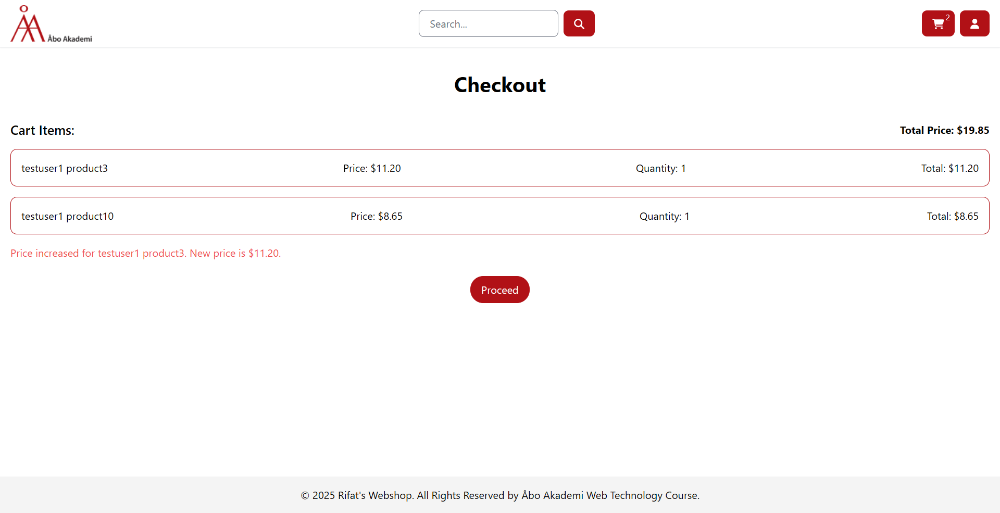

#### Completed order list of an authenticated user

## 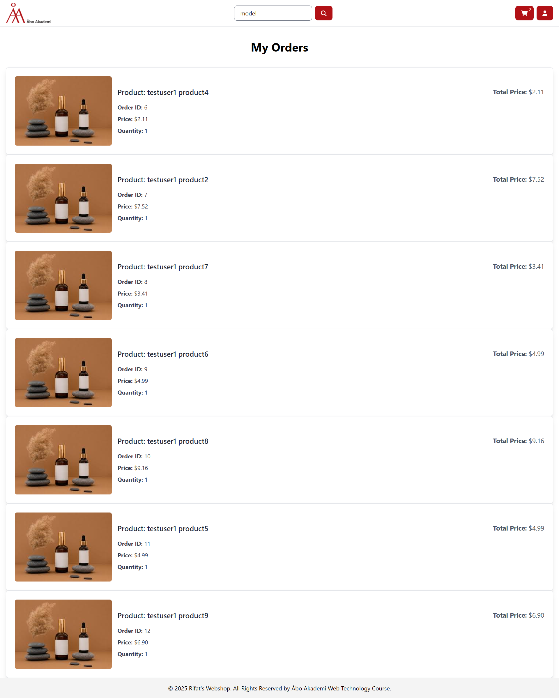

## Conclusion

**Incase of any issue while running and testing the application please reach out to me using the given email**
